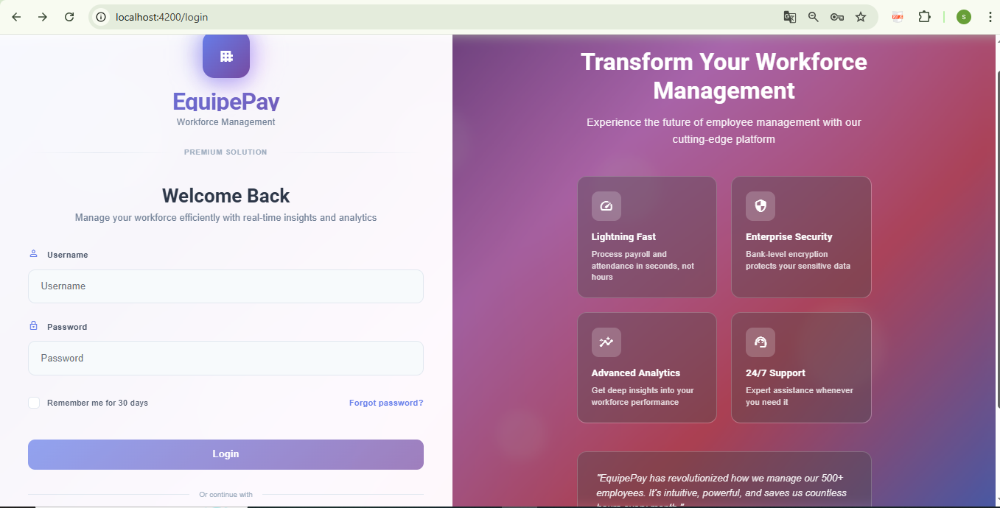
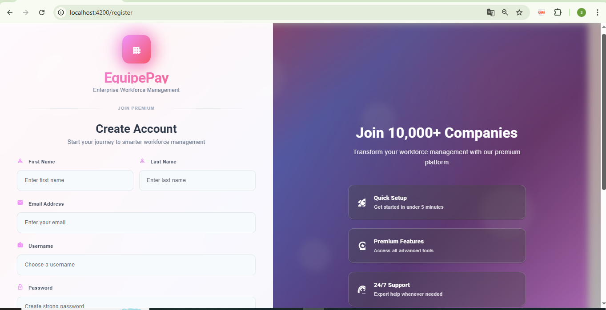
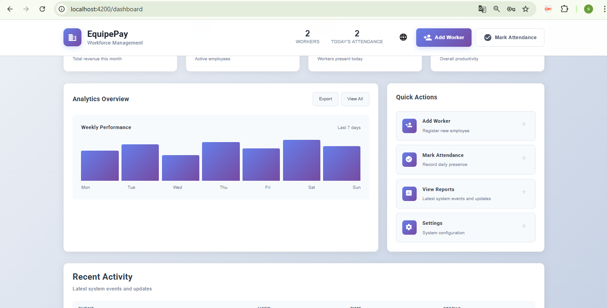
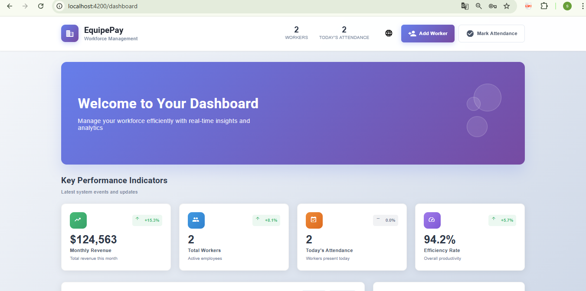
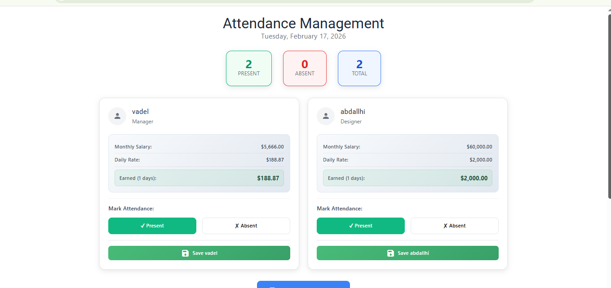
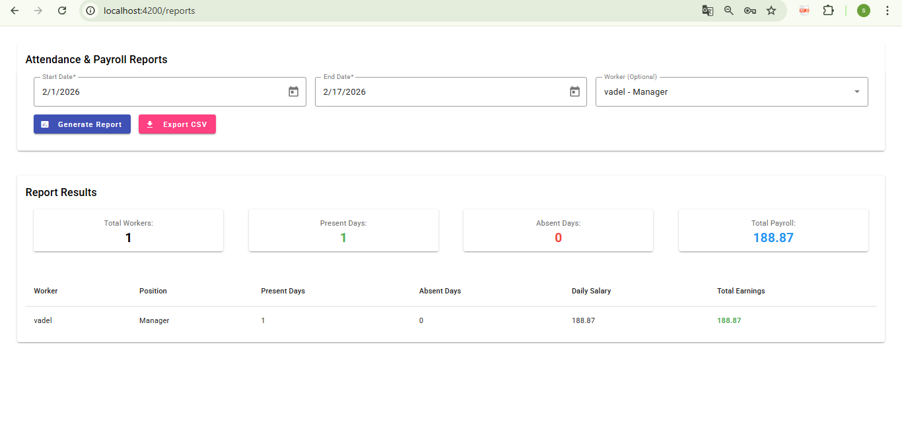

# EquipePay – Worker Attendance & Payroll Manager

Full-stack workforce management application designed for small and medium-sized businesses.  
Easily track daily worker attendance, automatically calculate salaries based on presence, generate detailed payroll reports, and manage employee information securely.

**Spring Boot** backend + **Angular** frontend — modern, responsive, secure, and production-ready.


## 🌟 Key Features

- Secure admin registration & login (JWT with access + refresh tokens)
- Full CRUD for workers (name, phone, position, monthly salary, join date, photo)
- Daily attendance marking (Present / Absent) with bulk save
- Automatic payroll calculation: daily rate = monthly salary / 30
- Real-time earned salary display per worker
- Beautiful dashboard with KPI cards, weekly charts & quick actions
- Date-range attendance & payroll reports + CSV export
- Modern UI with gradients, Angular Material + Tailwind CSS
- Responsive design (works well on desktop & mobile)
- Form validation, loading states, toast notifications

## Screenshots

### Authentication
  


### Dashboard
  


### Attendance Marking


### Reports & Payroll


*Screenshots captured on desktop view — the application is fully responsive.*

## 🛠️ Tech Stack

**Backend**
- Java 17 / 21
- Spring Boot 3.2+
- Spring Security + JWT authentication
- Spring Data JPA + Hibernate
- PostgreSQL
- Maven

**Frontend**
- Angular 17+ (standalone components)
- Angular Material
- Tailwind CSS
- RxJS for reactive programming
- TypeScript

**Other**
- REST API with DTOs
- JWT token management (localStorage + auto-refresh)
- Responsive & accessible UI

## 🚀 Quick Setup (Local Development)

### Prerequisites
- Java 17 or 21
- Node.js 18+ & npm
- PostgreSQL 13+
- Maven 3.8+

### 1. Database
```sql
CREATE DATABASE stafftrack;
-- or equipepay — make sure to use the same name in .env


2. Backend
cd backend

# Copy example configuration
cp ../.env.example .env

# Edit .env with your values
# Example:
# SPRING_DATASOURCE_URL=jdbc:postgresql://localhost:5432/stafftrack
# SPRING_DATASOURCE_USERNAME=postgres
# SPRING_DATASOURCE_PASSWORD=yourpassword
# JWT_SECRET=change-this-to-a-very-long-random-string-min-32-chars

# Run the application
mvn spring-boot:run
# or ./mvnw spring-boot:run (Linux/Mac)

→ Backend available at: http://localhost:8080
3. Frontend

cd frontend

npm install
ng serve
# or npm start

→ Frontend available at: http://localhost:4200
Register a new admin account on the register page to get started.

📁 Project Structure

stafftrack-payroll-manager/
├── backend/                # Spring Boot REST API
├── frontend/               # Angular single-page application
├── screenshots/            # Application interface captures
├── .env.example
├── .gitignore
└── README.md

🔧 Main API Endpoints (examples)
POST /api/auth/register
POST /api/auth/login
GET /api/workers
POST /api/workers
PUT /api/workers/{id}
DELETE /api/workers/{id}
POST /api/attendance
GET /api/reports?start=YYYY-MM-DD&end=YYYY-MM-DD

(Protected routes require Authorization: Bearer <jwt-token> header)

🚀 Deployment Options (Free / Low-cost)

Backend: Render.com, Railway.app, Fly.io, Heroku
Frontend: Vercel, Netlify, Cloudflare Pages
Database: Supabase PostgreSQL, Neon.tech, Render PostgreSQL, ElephantSQL

📄 License
MIT License — free to use, modify, fork, and learn from.
Built by Seydnealy
GitHub: https://github.com/seydnaalyeby
Portfolio: https://github.com/seydnaalyeby/seydnaaly-portfolio
Another showcase project: https://github.com/seydnaalyeby/travel-reservation-system
If this project is useful to you — feel free to ⭐ the repository!


